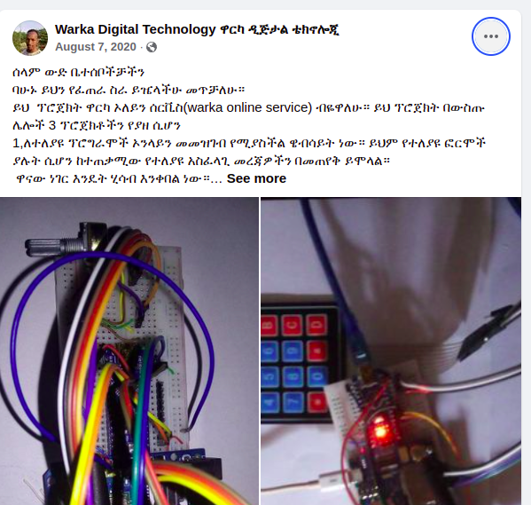

# Arduino-PaymentChaker

This project is for the purpose of cheking who is payed or not payed for particular event.
 If one event maker has an event, they can promot it online then the person who is registered and make payment online should be marked. This device tracks all the payments. Then at the day of the event if one is coming to attend or participate on the event, this device is used to pass the gate.

 # It has 2 parts

   ## Server to register and receive datas

   ## Device to check status of payment.

# The Server

It has a website interface to register users for particular event initiated by event makers.(Since the file of website is missing for now, I will develop new website soon!).

# The payment verifier device

It is arduino and GSM based device to receive the payment and verify it for userd if if is needed.

